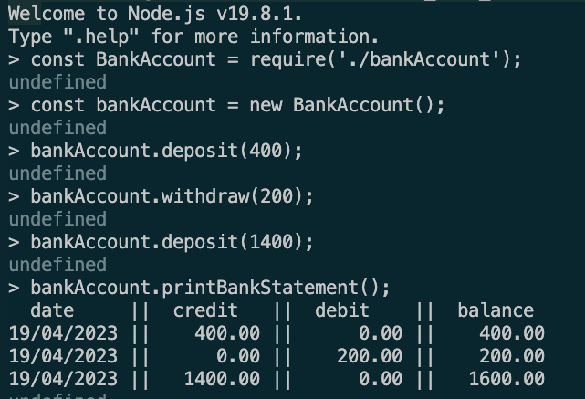
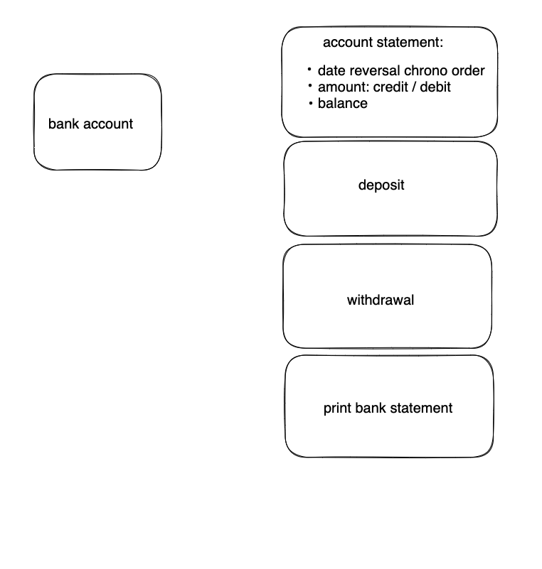
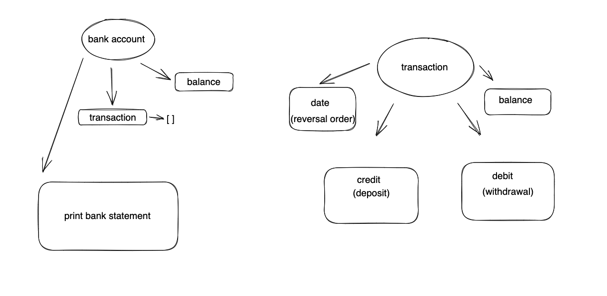

# Bank_tech_test

### Description

This is a simple banking application that allows users to make deposits, withdrawals and print bank statements.
It is implemented with Javascript, and can be run using REPL like Node.js and testing is done using the Jest testing framework.


### Specification

##### Requirements
> You should be able to interact with your code via a REPL like IRB or Node. (You don't need to implement a command line interface that takes input from STDIN.)
> Deposits, withdrawal.
> Account statement (date, amount, balance) printing.
> Data can be kept in memory (it doesn't need to be stored to a database or anything).

##### Acceptance criteria
+ Given a client makes a deposit of 1000 on 10-01-2023
+ And a deposit of 2000 on 13-01-2023
+ And a withdrawal of 500 on 14-01-2023
+ When she prints her bank statement
+ Then she would see

 ```
date       || credit  || debit  || balance
14/01/2023 ||    0.00 || 500.00 || 2500.00
13/01/2023 || 2000.00 ||   0.00 || 3000.00
10/01/2023 || 1000.00 ||   0.00 || 1000.00
```

### Installation

1. Clone the repo.

```
git clone https://github.com/ValeSer/bank_tech_test
```
2. Install Node.js and dependencies.<br />

```
npm install Eslint
```

3. Run tests.

```
npx jest --coverage --
```

### Usage

1. Start Node.js REPL.

```
node
```

2. Require the 'BankAccount' class.

```
const bankAccount = require('./bankAccount');
```
3. Create a new Bank account.

```
const bankAccount = new BankAccount();
```

4. Make deposits and withdrawals.

```
BankAccount.deposit(400);
BankAccount.withdraw(200);
BankAccount.deposit(1400);
```

5. Print a bank statement.

```
bankAccount.printBankStatement();
```

Which in this case should log:




### User stories (based on above acceptance criteria)

```
As a user
So that I can deposit money
I want to be able to add to my balance

As a user
So that I can withdraw money
I want to be able to subtract from my balance

As a user
So that I can see my balance
I want to be able to print out a statement
```

### Design

This is how I came up with what I needed to implement: 



The design consists of:

+ 'BankAccount' class - to keep track of the balance and transactions
  'deposit' and 'withdraw' methods - to update the balance and add   the record of the transaction to the Transactions array
  'printStatement' method - to print the log of all transactions in reverse chronological order, in a format matching the acceptance criteria

+ 'Transaction' class - to have a model of a transaction

### Improvements suggestions

Implement a 'Statement' class responsible for displaying the output on the screen.
 

